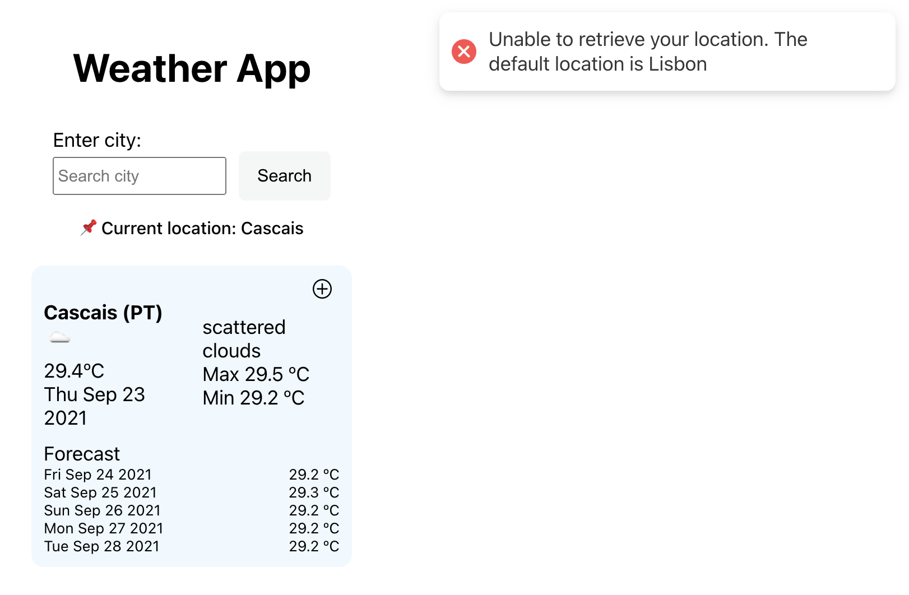
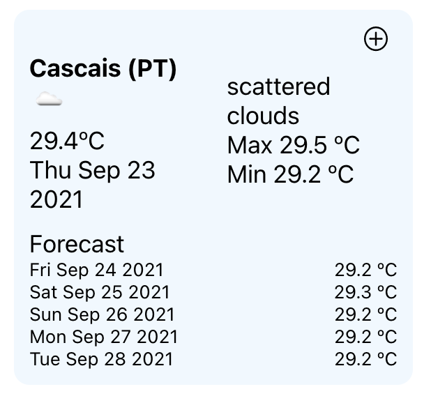
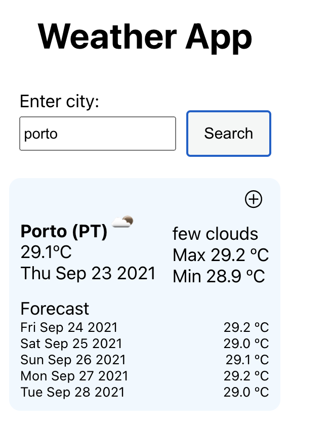
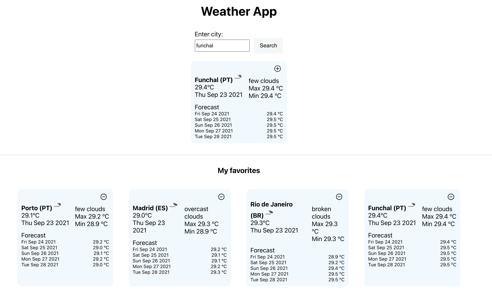

# Start Guide

## Features 🚀

1. **Default location (Cascais)**

   When the user doesn't allow the app to use the current location, the app shows a toast on the right corner and the API request is made with the default value (Cascais, Lisbon).

2. **Get weather and forecast for the current location**

   The app shows a card with information about the location, country, actual temperature, date, description, max, min temperature for the day. Also displays the forecast data for the next 5 days.

3. **Get weather and forecast for a specific city**

   When the user clicks on the search button with a specific city, the app displays a card with information about the city, country, actual temperature, date, description, max, min temperature for the day. Also displays the forecast data for the next 5 days.

4. **Add and remove cities to favourite list**

   When the user clicks on the + icon on the right corner of the card, the card will be added to a favourite list below. The user also can remove the card weather using the - icon.

5. **Persistent favourite city list**

   If the user adds cities to the favourite list and does a full refresh, the information is persistent and is display successfully.

---

## How to use [Open Weather Map API](https://openweathermap.org/api) ❓

Open Weather provides a collection of APIs to get weather data for any geographic coordinates.
In this project, I used the current weather and forecast (next 5 days) for the current user location but also for a specific city.

1. **Get weather and forecast data for the current location by coordinates**

   API call - weather

   > http://api.openweathermap.org/data/2.5/weather?lat={lat}&lon={lon}&appid={API key}

   API call - forecast

   > http://api.openweathermap.org/data/2.5/forecast?lat={lat}&lon={lon}&appid={API key}

2. **Get current weather and forecast data for a specific city**

   API call - weather

   > http://api.openweathermap.org/data/2.5/weather?q={city name}&appid={API key}

   API call - forecast

   > http://api.openweathermap.org/data/2.5/forecast?q={city name}&appid={API key}

Note 🚩

To make the API requests is mandatory to have an account on OpenWeather in order to have an API key registered.

---

## Assumptions 🔖

- Accordingly with OpenWeather API [subscriptions plans](https://openweathermap.org/price), with the free account is not possible to have access to forecast 10 days by city name. Taking this into account, I reduce the forecast information to 5 days, for current location and by city.

- If the app cannot fetch the user location, the default coordinates are Cascais (Lisbon):
  - latitude 38.6979
  - longitude -9.42146
